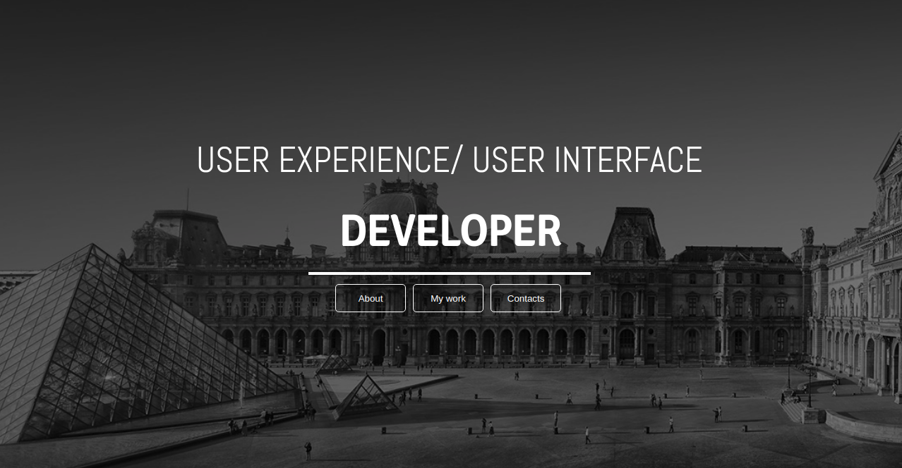

# my-portfolio

## Description
this is portfolio describing more about me and work i have done.

### Author
[Firdausa Salat](https://github.com/)

### Screenshot

## Setup and Installation
* Open terminal {Ctrl + Alt + T}
* git clone: https://github.com/firdausa7/my-portfolio.git
* Cd my-portfolio
* Code . or Atom . (Depending on the editor you have)

## Link to live page
(https://firdausa7.github.io/my-portfolio)

## Copyright & license
MIT LICENSE
&copy Firdausa salat

